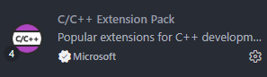
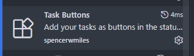
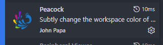
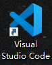
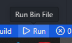

**语言: [English](README.md) · [中文](README_zh.md)**

我配置环境花了点时间,所以发了出来,希望可以帮助你节省时间 : )
note:  技术力有限供参考用

# 前提
vscode 需安装以下插件

C/C++ Extension Pack


Task Buttons


Peacock 美化插件


电脑安装以下软件

vscode


cmake


git


ninja build (配置好环境变量)

mingw-gcc

mingw-gdb

# 配置
## 1.克隆仓库
```
git clone https://github.com/bbbbmmdddd/ImGui-Demo-with-VS-Code-and-CMake.git
```
## 2.修改文件夹(ImGui-Demo-with-VS-Code-and-CMake)名称为 "你的项目名称"

## 3.修改 launch.json
```
//修改"ImGui_vscode_Demo" 为 "你的项目名称"
"program": "${workspaceFolder}/build/bin/ImGui_vscode_Demo.exe",

//修改"C:\\msys64\\mingw64\\bin\\gdb.exe" 为 "你的安装路径"
"miDebuggerPath": "C:\\msys64\\mingw64\\bin\\gdb.exe",
```

## 4.修改 tasks.json
```
//修改"ImGui_vscode_Demo" 为 "你的项目名称"
"command": "${workspaceFolder}/build/bin/ImGui_vscode_Demo.exe",
```
### 5.修改settings.json(可选项)
```
//修改"C:\\Program Files\\LLVM\bin" 为 "你的clangd安装路径"
"clangd.path": "C:\\Program Files\\LLVM\bin"
```

## 6.修改Cmakelists.txt
```
//修改"ImGui_vscode_Demo" 为 "你的项目名称"
project(ImGui_vscode_Demo)

//修改"ImGui_vscode_Demo" 为 "你的项目名称"
add_executable(ImGui_vscode_Demo ${SRC_FILES} ${IMGUI_SRC})

//修改"ImGui_vscode_Demo" 为 "你的项目名称"
target_include_directories(ImGui_vscode_Demo PRIVATE
    ImGui
)

//修改"ImGui_vscode_Demo" 为 "你的项目名称"
target_link_libraries(ImGui_vscode_Demo
    d3d11
    dxgi
    d3dcompiler
    user32
    gdi32
    dwmapi
    ole32
)
```

## 7.重命名 ImGui_vscode_Demo.code-workspace 文件为 "你的项目名称".code-workspace

# 使用
打开ImGui_vscode_Demo.code-workspace 工作区 就可以开始愉快的敲代码了 : )

CMake Configure


CMake Build Build项目(需执行一次Configure,才能自动Configure)


run 运行二进制文件(自动Build)


可设置快捷键 快速运行run
```
{
    "key": "f10",
    "command": "workbench.action.tasks.runTask",
    "args": "run"
}
```